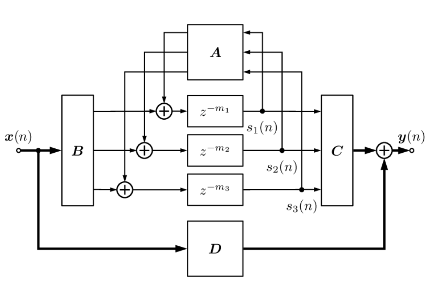

# EFFECTS

## Feedback Delay Network (FDN)

FDN is a digital signal processing architecture, mostly used for reverberation. The FDN consists of:
- Parallel delay lines;
- A feedback matrix;
- Additional filtering.

*Delay lines*: The signal (samples) is stored in a memory, in a circular buffer, and retrieved after a set number of clocks. The delay line’s lengths should be mutually prime to avoid periodicity and resonant coloration. 

*Feedback Matrix:* The matrix is the core element in digital reverbation. It controls how the parallel delay lines are mixed and fed back into the network, creating a dense, complex sound. The matrix defines the character of the network, typically chosen to be lossless and orthogonal.

*Hadamard matrix:*
- Orthogonal matrix with entries of +1, -1;
- Rows and columns are mutually orthogonal;
- Energy-preserving up to scale factor;
- Size constrained to powers of two.

- x(n) - input sample;
- y(n) - output sample (mixed);
- z - delay of the current delay line;
- A - mixing matrix;
- D - the dry signal, input sample;
- All the delay lines have a feedback coefficient (g), which is not shown in the diagram.