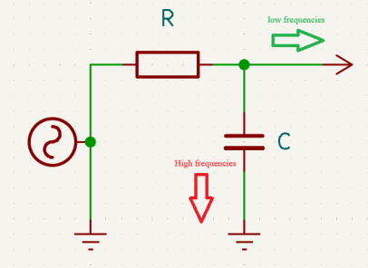
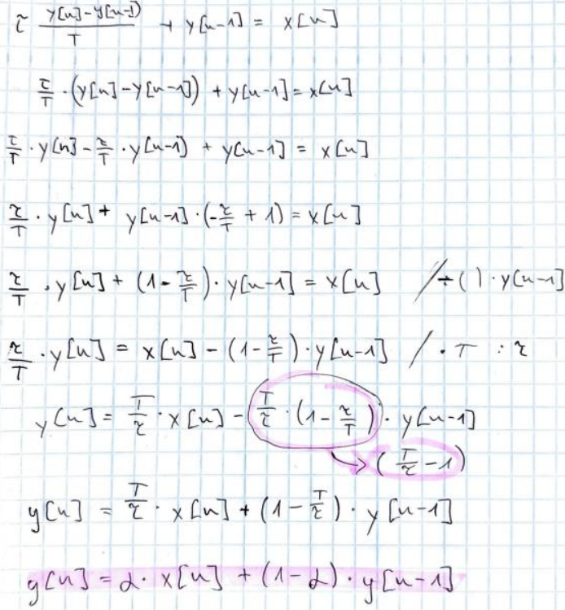
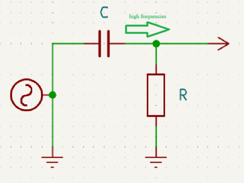
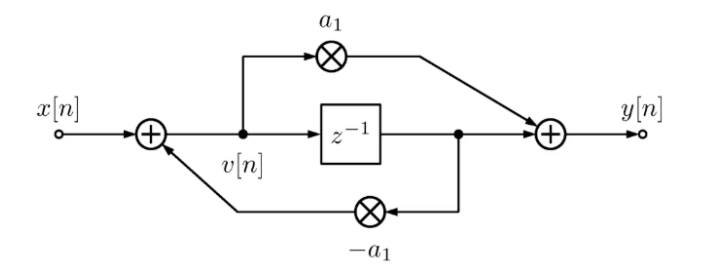

# FILTERS

## Low-pass filter



High frequencies can go through the capacitor; low frequencies are blocked. The picture shows that, the high frequencies shunted down to GND (high frequencies are lost) and the low frequencies are able to go through, into the network. The cutoff frequency is the point where an electronic filter/circuit starts significantly reducing signal power (frequency where the
power drops to -3dB).

### Analog domain

1. *Transfer function and analog differential equation:*
    $$
    H(s) = \frac{1}{(1 + s * R * C)} = \frac{1}{(1 + s * τ)} ∧ s = j * w
    $$
    
    *Frequency domain:*

    $$
    X(s) = Y(s) * (1 + s * τ)
    $$

    *Inverse Laplace, time domain:*

    $$
    x(t) = y(t) + τ * \frac{dy(t)}{dt}
    $$
    
    $$
    \frac{dy(t)}{dt} = \frac{1}{τ}*(x(t)-y(t))
    $$

2. *Cutoff frequency:*

$$
f_c = \frac{1}{2\pi RC}
$$

### Euler approximation:
Euler approximation is a numerical method used to approximate continuous-time
differential equations with discrete-time difference equations so they can be implemented on a digital system (DSP, MCU etc…).

*The problem what it solves:*

*Analog systems are described by differential equations:*

$$
\frac{dy(t)}{dt}=f(y(t),x(t))
$$

*Digital systems can only operate on samples:*

$$
y[n], x[n]
$$

$$
\frac{dy(t)}{dt} \approx{\frac{y[n]-y[n-1]}{T}}
$$

$$
T = \frac{1}{f_s}
$$

The fs is the sample rate, so T is the sampling period, and n is the sample index. Assumes the signal changes linearly between samples. The approximation provides a way to approximate the derivative using sample values.

### Digital domain

*Starting from the analog RC low-pass equation:*

$$
\tau * \frac{dy(t)}{dt}+y(t)=x(t)
$$

*Substitute the Euler approximation:*

$$
\tau * \frac{y[n]-y[n-1]}{T} + y[n-1]=x[n]
$$

*Which gives:*

$$
y[n]=\alpha * x[n] + (1-\alpha)*y[n-1]
$$

*NOTE: The deduction of this equation is at the end of chapter*

The α more accurate and widely used formulation (what I used):

$$
\alpha = 1 - e^{-2*\tau*\frac{f_c}{f_s}}
$$

| Analog RC      | DIGITAL IIR |
| ----------- | ----------- |
| Resistor      | Scaling factor       |
| Capacitor   | Memory y[n-1]        |
| RC time constant       | 1/alpha       |
| Cutoff frequency   | Computed from fc        |

### Code

```C
float LowPassFilter_OnePole::processLowPass(float input)
{
    lp_y_ += g_ * (input - lp_y_); 
    return lp_y_;
}
```

Here lp_y_ holds the previous output before the line executes:
lp_y_ = y[n-1]

The input is the x[n].

The g_ is the alpha.

### Deduction of Euler approximation:



## High-pass filter



Voltage across the capacitor cannot instantaneously change. High frequencies pass straight through the capacitor (as it would be a wire). Equation for cutoff frequency is the same as the low-pass filter. The voltage across the capacitor changes rapidly, so there is little time for charge to build up and block the flow.

### Analog domain:

*The high-pass involves the derivative of the input, while low-pass involves only the derivative of the output. The transfer functions:*

$$
H_{LP}(s) = \frac{1}{1 + s * \tau}
$$

$$
H_{HP}(s) = \frac{s * \tau}{1 + s * \tau}
$$

1. Transfer function and analog differential equation:

$$
\frac{dy(t)}{dt}=\frac{1}{\tau}*(x(t) + y(t))'
$$

$$
(1 + s * \tau) * Y(s) = s * \tau * X(S)
$$

$$
y(t) + \tau * \frac{dy(t)}{dt} = \tau * \frac{dx(t)}{dt}
$$

The high-pass filter responds to changes in the input, DC components vanish.

### Digital domain:

$$
\frac{dx}{dt} \approx{\frac{x[n]-x[n-1]}{T}}
$$

$$
\frac{dy}{dt} \approx{\frac{y[n]-y[n-1]}{T}}
$$

*Which gives:*

$$
y[n]=\alpha * (y[n-1]+x[n]-x[n-1])
$$

### Code:

```C
float HighPassFilter_OnePole::processHighPass(float input)
{
    hp_y_ = g_ * (hp_y_ + input - hp_input_prev_);
    hp_input_prev_ = input;
    return hp_y_;
}
```

## Allpass filter

No frequencies get boosted or attenuated (as high pass or low pass filter does), allpass
introduces a phase shift. So, allpass filter does not change the amplitude of any frequency but does change the phase of the signal.



In the reverb algorithm I used a cascading allpass filter as diffusion stage for the FDN (feedback delay network). It increases the echo density without colouring the sound. 

1. Canonical Schroeder allpas filter:

$$
y[n] = -g * x[n] + x[n-D]+g*y[n-D]
$$

D - Delay time in samples

𝑑[𝑛] = 𝑏𝑢𝑓[𝑛 − 𝐷]

𝑏𝑢𝑓[𝑛] = 𝑥[𝑛] − 𝑔 ∗ 𝑑[𝑛]

𝑦[𝑛] = 𝑑[𝑛] +𝑔 ∗ 𝑏𝑢𝑓[𝑛]

2. Code:

```C
    for(size_t n = 0; n < DELAY_LINE_NUM_AP; n++)
    {
        delayed =  ap_delay_[n].Read();                     
        buf = input - gain * delayed;     
        output = delayed + gain * buf;       
        ap_delay_[n].Write(buf);
        input = output;                                    
    }
```

input – x[n]

delayed – d[n]

buf = buf[n]

output – y[n]

Each ap_delay_[n]_ has a different delay length, in this way the function works as a cascading
(multiple) all pass filter.